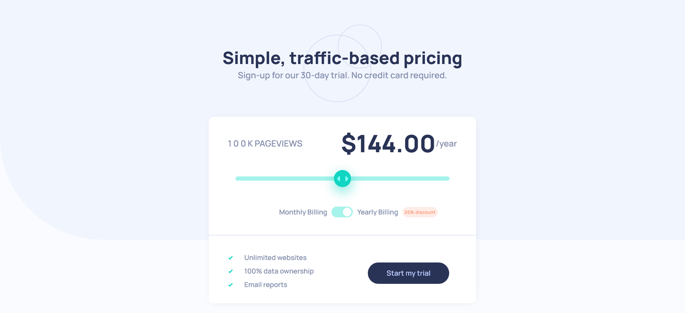

# Frontend Mentor - Interactive pricing component solution

Essa é a solução para o [desafio Interactive Pricing Component do site Frontend Mentor](https://www.frontendmentor.io/challenges/interactive-pricing-component-t0m8PIyY8). 

## Sumário

- [Visão Geral](#visão-geral)
  - [O Desafio](#o-desafio)
  - [Screenshot](#screenshot)
  - [Link](#link)
- [Meu processo](#meu-processo)
  - [Desenvolvido com](#desenvolvido-com)
  - [O que eu aprendi](#o-que-eu-aprendi)

## Visão Geral

### O Desafio

O usuário é capaz de:

- (EM PROCESSO) Ver o layout responsivo em qualquer dispositivo. 
- Poder interagir com o elementos da página.
- Usar o slider e o toggle button para ver os diferentes preços e os números de visualizações da página.

### Screenshot

### Link

- [Link para ver o site funcionando](https://thiagocontelli.github.io/interactive-pricing-component/)

## Meu processo

### Desenvolvido com:

- HTML5
- CSS3
  - Flexbox
- Vanilla JavaScript

### O que eu aprendi

Esse projeto me ajudou a desenvolver minhas habilidades na manipulação do DOM, validações e eventos, questões que ainda estavam superficiais pra mim. Apesar de ser um projeto simples, é usado diversas funcionalidades que serão úteis em vários projetos que irei desenvolver futuramente.